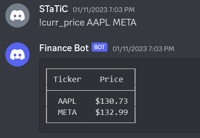

## Installation
1. Python 3.7 or above is required.
2. Run `git clone git@github.com:NexhmedinQ/Discord-Finance-Bot.git`
3. Run `pip install -r requirements.txt`
4. In a `.env` file place the discord token.
5. Change the dsn in the `create_db_pool` function in `bot.py` to connect the bot to your own database. 
6. Run the bot with `python3 bot.py`. 

## Usage and Features
`!curr_price` - Returns the latest price of of ticker/s specified.

`!earnings` - Returns a yearly graph of a companies earnings over the past 4 years.

`!quarterly_earnings` - Returns a quarterly graph of a companies earnings over the past 4 quarters.

`!balance_sheet` - Returns a companies balance sheet from the most recent end of financial year.

`!add_news` - Add a company to a watchlist that sends news articles related to the company every day at 9am. 

`!remove_news` - Remove a company from the news watchlist. 
